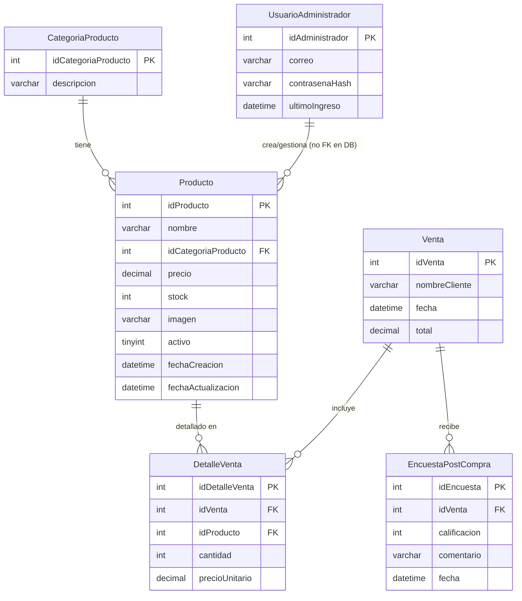

# Documentación de la Base de Datos `MateGo`

Este documento detalla la estructura y propósito del script de base de datos `20251115-1325_CreacionBaseDeDatos.sql`.

## Resumen General

El script se encarga de:
1.  **Crear la base de datos `MateGo`** si no existe, configurada con `utf8mb4`.
2.  **Definir la estructura de las tablas** necesarias para la aplicación.
3.  **Establecer relaciones** entre las tablas mediante claves foráneas.
4.  **Poblar la base de datos** con datos iniciales (seed) para un funcionamiento básico.

## Diagrama de Entidad-Relación (MER)

A continuación se presenta un diagrama conceptual de las relaciones entre las tablas principales:

## Descripción de Tablas

### `CategoriaProducto`
Almacena las categorías a las que puede pertenecer un producto.

-   `idCategoriaProducto`: Identificador único de la categoría.
-   `descripcion`: Nombre de la categoría (ej: 'Mates', 'Yerbas'). Es único.

### `UsuarioAdministrador`
Guarda las credenciales de los usuarios que pueden administrar el sistema.

-   `idUsuarioAdministrador`: Identificador único del administrador.
-   `correo`: Email del administrador, usado para el login. Es único.
-   `contrasenaHash`: Contraseña encriptada.
-   `ultimoIngreso`: Fecha y hora del último inicio de sesión.

### `Producto`
Contiene la información de cada producto disponible para la venta.

-   `idProducto`: Identificador único del producto.
-   `nombre`: Nombre del producto.
-   `idCategoriaProducto`: Referencia a la tabla `CategoriaProducto`.
-   `precio`: Precio de venta actual.
-   `stock`: Cantidad de unidades disponibles.
-   `imagen`: Nombre del archivo de imagen del producto.
-   `activo`: Indicador de si el producto está disponible (`1`) o dado de baja (`0`).
-   `fechaCreacion`: Fecha de alta del producto.
-   `fechaActualizacion`: Fecha de la última modificación (se actualiza automáticamente).

### `Venta`
Registra cada transacción de venta realizada.

-   `idVenta`: Identificador único de la venta.
-   `nombreCliente`: Nombre del cliente que realiza la compra.
-   `fecha`: Fecha y hora en que se realizó la venta.
-   `total`: Monto total de la venta.

### `DetalleVenta`
Tabla intermedia que relaciona `Venta` y `Producto`, detallando los productos incluidos en cada venta.

-   `idDetalleVenta`: Identificador único del detalle.
-   `idVenta`: Referencia a la tabla `Venta`.
-   `idProducto`: Referencia a la tabla `Producto`.
-   `cantidad`: Número de unidades vendidas de este producto en esta venta.
-   `precioUnitario`: Precio del producto al momento de la venta (histórico).

### `EncuestaPostCompra`
Almacena la retroalimentación de los clientes después de una compra.

-   `idEncuesta`: Identificador único de la encuesta.
-   `idVenta`: Referencia a la venta asociada a la encuesta.
-   `calificacion`: Puntuación de 1 a 5.
-   `comentario`: Comentarios adicionales del cliente.
-   `fecha`: Fecha en que se completó la encuesta.

## Datos Iniciales (Seed)

El script finaliza insertando un conjunto de datos básicos para que la aplicación sea funcional desde el inicio:

-   **Categorías:** 'Mates', 'Yerbas', 'Accesorios'.
-   **Usuario Administrador:** Un usuario `admin@matego.local` con una contraseña hash de ejemplo que **debe ser reemplazada**.
-   **Productos:** Seis productos de ejemplo distribuidos en las categorías creadas.
-   **Venta de Ejemplo:** Una venta de demostración con dos productos para ilustrar el funcionamiento.
